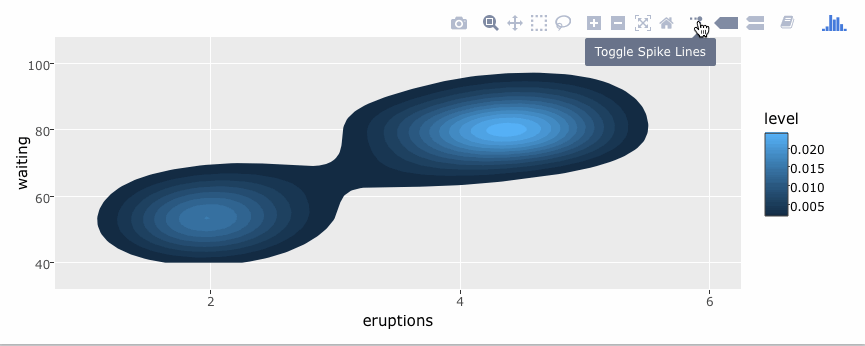
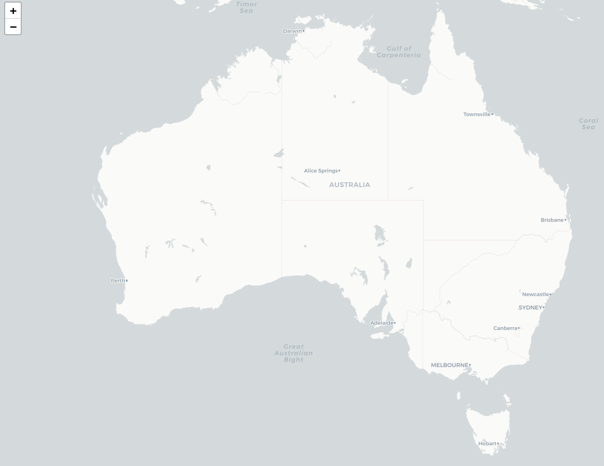
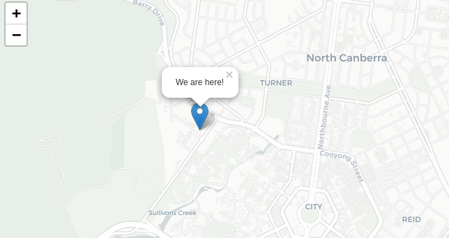
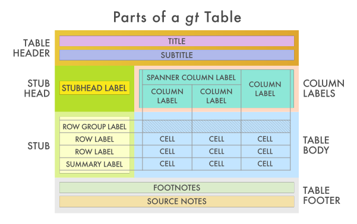

class: inverse
background-image: url("resources/title.jpg")
background-size: cover

```{r setup, include=FALSE}
options(htmltools.dir.version = FALSE, width = 120)

library(tidyverse)
library(shiny)
library(countdown)
library(fontawesome)

theme_set(
  theme_grey(base_size = 16) +
  theme(
    legend.position = "bottom",
    plot.background = element_rect(fill = "transparent"),
    legend.background = element_rect(fill = "transparent")
  )
)
```


```{css, echo=FALSE}
/* custom.css */
.left-code {
  color: #777;
  width: 40%;
  height: 92%;
  float: left;
}
.right-plot {
  width: 58%;
  float: right;
  padding-left: 1%;
}
```

<ul class="hextile clr">
	<li>
    <div>
      <h1>05</h1>
      <p style = "padding-top: 30%; font-size: 1.2em">Extension packages</p>
    </div>
  </li>
  <li>
    
  </li>
  <li></li>
  </li>
  <li>
    <div>
      <p style = "padding-top: 15%; font-size: 1.33em">
      Mitchell O'Hara‑Wild<br>
      (Nectric)
      </p>
    </div>
  </li>
</ul>

.footnote[
Materials at [workshop.nectric.com.au/intermediate-shiny](https://workshop.nectric.com.au/intermediate-shiny)
]

---
background-image: url("resources/awesome-shiny-extensions.jpg")
background-size: cover

<br>

.box-12.bg-blond.bottom-margin.center[
Curated list of extensions packages by Nan Xiao (肖楠)  
https://github.com/nanxstats/awesome-shiny-extensions
]


---
class: topic-starter, center

# Packages for theming

---

# `r emo::ji("art")` Change colour swatches with `shinythemes`

This package provides colour schemes from http://bootswatch.com/.

--

The fastest and easiest way to change the appearance of your app.

To use it, specify the `theme` argument in your **UI's page function**.

```{r, eval = FALSE}
fluidPage(
  theme = shinythemes::shinytheme("superhero"),
  # The rest of your UI code goes here.
)
```

---
class: feature

# `r emo::ji("shooting_star")` Your turn!

.box-12[

## Pick a style for your app `r emo::ji("art")`

Use `shinythemes` to change the theme for your gallery.

1. Go to http://bootswatch.com/ and choose a theme you like.
1. Open `06_gallery` and use `shinythemes` to set the app's theme by name.

Hint: Code for setting the theme to "superhero" is shown on the previous page.

<br>

]

```{r, echo = FALSE}
countdown(minutes = 3L, seconds = 0L)
```

---

# `r emo::ji("gear")` Pretty inputs and widgets with shinyWidgets

The shinyWidgets package provides a lot of widgets!

Read their website for all features provided: https://dreamrs.github.io/shinyWidgets/index.html

Their inputs follow the same structure as shiny inputs:

```{r, eval = FALSE}
library(shinyWidgets)
switchInput(inputId = "id", value = TRUE)
```


---
class: feature

# `r emo::ji("shooting_star")` Your turn!

.box-12[

## Give carousel mode a new look `r emo::ji("eye")`

1. Use `switchInput()` from shinyWidgets instead of `checkboxInput()` for carousel mode in the Bob Ross gallery.
1. Open the app and try it out. Does the feature still work?

]

```{r, echo = FALSE}
countdown(minutes = 3L, seconds = 0L)
```

---

# `r emo::ji("bar_chart")` Dashboard layouts with `shinydashboard`

`shinydashboard` provides a new layout for apps based on AdminLTE.

While designed for dashboards, I find the layout suitable for many apps.

```{r, eval = FALSE}
library(shiny)
library(shinydashboard)

ui <- dashboardPage(
  dashboardHeader(),
  dashboardSidebar(),
  dashboardBody()
)

server <- function(input, output) { }

shinyApp(ui, server)
```

The dashboard's UI is split into three parts: header, sidebar and body.

---

# `r emo::ji("bar_chart")` Dashboard layouts with `shinydashboard`

This layout may look familiar - I use it a lot!


---

# `r emo::ji("bar_chart")` Dashboard layouts with `shinydashboard`

For containing UI elements, `shinydashboard` provides boxes:

* `box()`: A basic box for any content (inputs, plots, tables)
* `tabBox()`: A box with tabs for content
* `infoBox()`: Suitable for displaying numbers or short text
* `valueBox()`: Like `infoBox()`, but emphasises the number

More details about these boxes and how to use can be found here:  
https://rstudio.github.io/shinydashboard/structure.html#boxes

You can also use `shinydashboardPlus` to unlock more features.

---

# `r emo::ji("bar_chart")` Dashboard layouts with `shinydashboard`

The sidebar is typically used to display page tabs, but can also show inputs.

```{r, eval = FALSE}
library(shiny)
library(shinydashboard)
ui <- dashboardPage(
  dashboardHeader(title = "My app"),
  dashboardSidebar(
    sidebarMenu(
      menuItem("Dashboard", tabName = "dashboard", icon = icon("dashboard")),
      menuItem("Widgets", tabName = "widgets", icon = icon("th"))
    )
  ),
  dashboardBody(
    tabItem(tabName = "dashboard", "Dashboard tabs"),
    tabItem(tabName = "widgets", "Widgets tab contents")
  )
)
server <- function(input, output) { }
shinyApp(ui, server)
```


---
background-image: url("resources/shinymaterial.png")
background-size: contain
background-position: top

<br>
.box-12.bg-blond.bottom-margin.center[
Great altenative: `shinymaterial`

https://ericrayanderson.github.io/shinymaterial/
]
---
class: topic-starter, center

# Packages for data visualisation

---

# `r emo::ji("framed_picture")` Base graphics / ggplot2

While not an extension package, shiny adds interactive features to all plots.

It is possible to allow users to interact with plots and images with clicks (single and double), hovers and area selection (brushing).

```{r}
plotOutput(
  "my_plot_id",
  click = "plot_click", # input$plot_click gives click coordinates
  dblclick = "plot_double_click", # same as click, but for double clicks
  hover = "plot_hover", # input$plot_hover gives hovered cursor coordinates
  brush = "plot_area" # input$plot_area gives the coordinates of a selected area
)
```

This allows you to show a plot of data, and allow users to select an area of interest for future analysis.

---

# `r emo::ji("paintbrush")` Interactive plots with `plotly`

Allows hovering data labels and interactive zooming of plots.

Best of all, if you know `ggplot2` you can convert them with `ggplotly()`.

```{r, eval = FALSE}
library(plotly)
g <- ggplot(faithful, aes(x = eruptions, y = waiting)) +
  stat_density_2d(aes(fill = ..level..), geom = "polygon") + 
  xlim(1, 6) + ylim(40, 100)
ggplotly(g)
```



In Shiny, add `plotlyOutput()` to the UI and use `renderPlotly()` in the server.

---

# `r emo::ji("world_map")` Map your data with `leaflet`

A base map is created with `leaflet()`. Provider tiles customise appearance.

A list of usable provider tiles can be seen here: [leaflet provider previews](http://leaflet-extras.github.io/leaflet-providers/preview/index.html)

```{r, eval = FALSE}
library(leaflet)
leaflet() %>%
  addProviderTiles(providers$CartoDB.Positron)
```



---

# `r emo::ji("world_map")` Map your data with `leaflet`

Data elements are added in layers on top of the base map.

Many things can be added to the map, but we'll focus on markers.

```{r, eval = FALSE}
library(leaflet)
leaflet() %>%
  addProviderTiles(providers$CartoDB.Positron) %>% 
  addMarkers(lng=149.11512679640174, lat=-35.273665647661815, popup="We are here!")
```



---

# `r emo::ji("world_map")` Map your data with `leaflet`

A leaflet plot is added to shiny using `leafletOutput()` for the UI and `renderLeaflet()` in the server.  
Updating existing maps is done with observers and `leafletProxy()`.

```{r, eval = FALSE}
library(shiny)
library(leaflet)
ui <- fluidPage(
  actionButton("show_me", "Show me on the map"),
  leafletOutput("map_id")
)
server <- function(input, output, session) {
  output$map_id <- renderLeaflet({
    leaflet() %>%
      addProviderTiles(providers$CartoDB.Positron)
  })
  observeEvent(input$show_me, {
    leafletProxy("map_id", session) %>% 
      addMarkers(lng=149.11512679640174, lat=-35.273665647661815, popup="We are here!")
  })
}
shinyApp(ui, server)
```

---

# `r emo::ji("world_map")` Map your data with `leaflet`

Markers can be added from data too:

```{r, eval = FALSE}
leafletProxy("map_id", session) %>% 
  addMarkers(lng= ~LONGITUDE, lat= ~LATITUDE, data = my_data)
```

Other marker styles may be more appropriate for showing data.

I usually use semi-transparent circles without borders.

```{r, eval = FALSE}
addCircleMarkers(stroke = FALSE, fillOpacity = 0.5)
```

---

# `r emo::ji("world_map")` Map your data with `leaflet`

When giving a map, show only the area of interest.

You can set the view position with `setView()`. For Canberra:

```{r, eval = FALSE}
leaflet() %>%
  addProviderTiles(providers$CartoDB.Positron) %>% 
  setView(149.12, -35.27, zoom = 9)
```

You can also animate the the zooming with `flyTo()`

---
class: feature

# `r emo::ji("shooting_star")` Your turn!

.box-12[

## Make a map of local BBQs `r emo::ji("world_map")`

Use `leaflet` and a shiny layout of your choice to show nearby public BBQs.

1. Download the data from [this page](https://www.data.act.gov.au/Infrastructure-and-Utilities/Public-Barbeques-in-the-ACT/n3b4-mm52)
1. Create a new shiny app (you can copy an old one for a quick start)
1. Write code into `global.R` for reading in the data
1. Add `leafletOutput()` to `ui.R`, and `renderLeaflet()` to `server.R`
1. For your base map, use tiles you like and zoom in on canberra
1. Add markers for the BBQ locations of ACT.

<br>

]

```{r, echo = FALSE}
countdown(minutes = 10L, seconds = 0L)
```

---
class: topic-starter, center

# Packages for table displays

---

# `r emo::ji("computer")` Interactive tables with `DT`

`DT` provides an interface to the great JS DataTables library

These tables are highly customisable, and lots of help is available online.

In Shiny, use `DT::DTOutput()` in the UI and `DT::renderDT()` in the server.

Use the `datatable()` function for more display options.

More details: https://rstudio.github.io/DT/

---

# `r emo::ji("computer")` Great alternative: gt



A new package for tables by RStudio: https://gt.rstudio.com/


---
class: feature

# `r emo::ji("shooting_star")` Your turn!

.box-12[

## Add a table of BBQs `r emo::ji("computer")`

Use `DT` to add a table of your BBQ data.

1. Open your new shiny app with the map
1. Add `DT::DTOutput()` to a new tab in the UI
1. Add a table of the BBQ locations with `DT::renderDT()`

<br>

]

```{r, echo = FALSE}
countdown(minutes = 5L, seconds = 0L)
```

