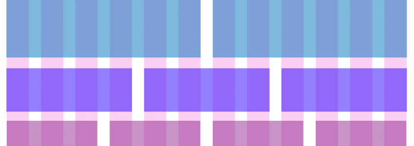
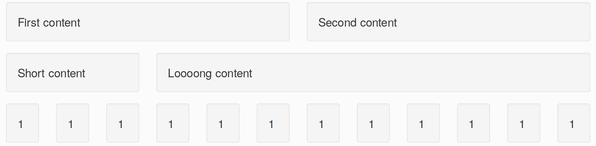
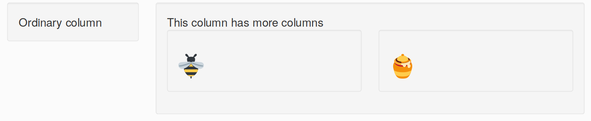

class: inverse
background-image: url("resources/title.jpg")
background-size: cover

```{r setup, include=FALSE}
options(htmltools.dir.version = FALSE, width = 120)

library(tidyverse)
library(shiny)
library(countdown)
library(fontawesome)

theme_set(
  theme_grey(base_size = 16) +
  theme(
    legend.position = "bottom",
    plot.background = element_rect(fill = "transparent"),
    legend.background = element_rect(fill = "transparent")
  )
)
```


```{css, echo=FALSE}
/* custom.css */
.left-code {
  color: #777;
  width: 40%;
  height: 92%;
  float: left;
}
.right-plot {
  width: 58%;
  float: right;
  padding-left: 1%;
}
```

<ul class="hextile clr">
	<li>
    <div>
      <h1>05</h1>
      <p style = "padding-top: 30%; font-size: 1.2em">Style & Design</p>
    </div>
  </li>
  <li>
    
  </li>
  <li></li>
  </li>
  <li>
    <div>
      <p style = "padding-top: 15%; font-size: 1.33em">
      Mitchell O'Hara‑Wild<br>
      (Nectric)
      </p>
    </div>
  </li>
</ul>

.footnote[
Materials at [workshop.nectric.com.au/intermediate-shiny](https://workshop.nectric.com.au/intermediate-shiny)
]

---
class: bg-yellow feature

# `r emo::ji("target")` Today's goals

<br>

.box-12.larger[
1. Customise the **look and feel** of apps
1. Learn the **languages of the web**
1. Use **extension packages** to add functionality
1. **Apply** the workshop content to your own apps
]

---

.pull-left[
Workshop day 1

| Time          | Activity                                                      |
|:--------------|:--------------------------------------------------------------|
| 09:00 - 09:30 | Arrive and get set up `r emo::ji("computer")`                              |
| 09:30 - 10:45 | Session 1 `r emo::ji("sparkles")` <br> *Introduction to Shiny*             |
| 10:45 - 11:00 | *Morning tea* `r emo::ji("tea")`                                    |
| 11:00 - 12:30 | Session 2 `r emo::ji("boom")` <br> *Reactive programming I*                |
| 12:30 - 13:15 | *Lunch* `r emo::ji("fork_and_knife")`                                      |
| 13:15 - 14:45 | Session 3 `r emo::ji("trophy")` <br> *Troubleshooting and testing*         |
| 14:45 - 15:00 | *Q&A break* `r emo::ji("question")`                                        |
| 15:00 - 16:30 | Session 4 `r emo::ji("boom")` <br> *Reactive programming II*               |

]

.pull-right[
Workshop day 2

| Time          | Activity                                                      |
|:--------------|:--------------------------------------------------------------|
| 09:00 - 09:30 | Arrive and get set up `r emo::ji("computer")`                          |
| 09:30 - 10:45 | Session 1 `r emo::ji("art")` <br> *Application design and customisation*   |
| 10:45 - 11:00 | *Morning tea* `r emo::ji("tea")`                                           |
| 11:00 - 12:30 | Session 2 `r emo::ji("link")` <br> *Doing more with extension packages*    |
| 12:30 - 13:15 | *Lunch* `r emo::ji("fork_and_knife")`                                      |
| 13:15 - 15:00 | Session 3 `r emo::ji("tada")` <br> *Work on your own Shiny app*            |
]

---
class: topic-starter, center

# Quick recap

---
class: topic-starter, center

# Designing for the web

---
background-image: url("resources/arngren.png")
background-size: contain
background-position: top

.box-12.bg-blond.bottom-margin.center[
# App design and layout is important!
]

---
background-image: url("resources/bootstrap.png")
background-size: contain
background-position: top

.box-12.bg-blond.bottom-margin.center[
# Shiny layouts are built with Bootstrap

https://getbootstrap.com/docs/3.4/
]

---

# `r emo::ji("art")` Why use Bootstrap?

It's **simple** to create **responsive** layouts for the web.

Bootstrap components allow easy composition of pleasant interfaces.

It is widely used on the web, making many themes and help available online.

Themes: https://bootswatch.com/

Help: https://stackoverflow.com/questions/tagged/bootstrap-4

---

# `r emo::ji("house_with_garden")` Page layouts: the home for content

Shiny offers several page layouts which all use Bootstrap.

.pull-left[
* `fluidPage()` 
* `fillPage()`
]
.pull-right[
* `navbarPage()`
* `fixedPage()`
]

--

We've seen `fluidPage()` in examples as provides a nice foundation.

`fillPage()` is similar to `fluidPage()` but ensures height coverage.

`navbarPage()` is `fluidPage()` with a top navigation bar.

`fixedPage()` keeps the *grid* width fixed for various display sizes.

---

# `r emo::ji("black_square_button")` The bootstrap grid

The framework achieves responsive design with a **grid based system**.

[](https://helenaboitsova.com/uikit-grid-accordance-to-bootstrap-grid/)

The grid contains **12 columns** which content may span across.

---

# `r emo::ji("black_square_button")` The bootstrap grid

```{r, eval = FALSE}
fluidPage(
  fluidRow(
    column(6, wellPanel("First content")),
    column(6, wellPanel("Second content"))
  ),
  fluidRow(
    column(3, wellPanel("Short content")),
    column(9, wellPanel("Loooong content"))
  ),
  do.call(fluidRow, rep(list(column(1, wellPanel("1"))), 12))
)
```



---

# `r emo::ji("black_square_button")` The bootstrap grid

Grids can also be used within grids!

```{r, eval = FALSE}
fluidPage(
  fluidRow(
    column(3, wellPanel("Ordinary column")),
    column(9, wellPanel("This column has  more columns",
                        fluidRow(column(6, wellPanel(h1(emo::ji("bee")))),
                                 column(6, wellPanel(h1(emo::ji("honey")))))
    ))
  )
)
```



---

# `r emo::ji("hiking_boot")` (Not-so) secret Bootstrap components

We've seen just a few of many components made available by Bootstrap.

We'll see how to access more components by writing HTML soon.

<hr>

--

The shiny package only provides a few essential components, however more are accessible by writing the HTML directly.

.center.box-12.bg-blond[
Find all available Bootstrap components here:  
https://getbootstrap.com/docs/3.4/components/
]

---
class: feature

# `r emo::ji("shooting_star")` Your turn!

.box-12[
## Reorganise gallery's inputs using the grid system `r emo::ji("broom")`

1. Use `wellPanel()` to collect related inputs into the same well
1. Remove the width argument from the buttons and the `span()` to space them. Instead use the bootstrap grid to neatly position these buttons.
1. Change the grid width of the input section from 4 to 2.
1. What happens to the grid when you make your web browser smaller?
]

```{r, echo = FALSE}
countdown(minutes = 5L)
```

---

# shinythemes

---

# Changing ggplot2 colour scheme

```{r, eval = FALSE}
+ theme()

theme_set(
  theme_grey(base_size = 16) +
  theme(
    legend.position = "bottom",
    plot.background = element_rect(fill = "transparent"),
    legend.background = element_rect(fill = "transparent")
  )
)
```


---

# The languages of the web

Shiny is great as it allows you to create useful webpages by writing in one language.


### HTML

### CSS

### JavaScript


---

# Focus on HTML and CSS

---

# HTML

Defines the content of the website (buttons, text, links, images, etc.)

A series of tags of the form:

```html
<tag attr_name = attr_content> child_content </tag>
```

**Most** tags have a starting (`<tag>`) and ending (`</tag>`) tag, and attributes are specified in the starting tag.

---

# Writing tags with `htmltools`

```{r}
img(src = "resources/shiny.svg")
a(href = "https://www.nectric.com.au", emo::ji("bee"))
```


---
class: feature

# `r emo::ji("shooting_star")` Your turn!

.box-12[
## Add a links to your app

The website https://www.twoinchbrush.com/ provides a collection of information about each Bob Ross painting. This is where the gallery's images are from, however each painting's page provides more information (paints used and video URL).

Use uiOutput() and renderUI() to add links to the painting's URL on twoinchbrush.com.
]

---

# Using other bootstrap components

https://getbootstrap.com/docs/3.4/components/

This page shows all bootstrap components available in Shiny.

Most of these don't have convenient high-level R functions.

But you can still access them by writing your own HTML.


---

# Classes and IDs

Classes are used to associate a tag with a group.
IDs are used to uniquely identify a tag.

Classes can be used to give content groups a style.
InputIDs provided to shiny are used as the ID for the field's tag.

---

# CSS

Defines the style of the website (colours, size, positioning, etc.)

A series of rules of the form:

```css
selector {
  property: value;
}
```

---

# CSS selectors

Selector          |  Example         |     Description
------------      |------------------|      ------------------------------------------------
element           |  `p`             |      Select all &lt;p&gt; tags
element element   |  `div p`         |      Select all &lt;p&gt; tags inside a &lt;div&gt; tag          
element>element   |  `div > p`       |      Select all &lt;p&gt; tags with &lt;div&gt; as a parent
.class            |  `.title`        |      Select all tags with class="title"
\#id              |  `#name`         |      Select all tags with id="name"

---

# `r emo::ji("detective")` Webpage inspector, find that selector!

Knowing how to identify elements on the web has several uses:

1. Changing the style of the element (what we're doing!)
1. Modifying the element with JavaScript
1. Scraping data from the web

It also allows you to see the style applied to existing attributes.

Open the Bob Ross gallery app with your preferred web browser.

---

# CSS property-value pairs

There are hundreds of properties which can be specified using CSS.

Learning all of these properties is not necessary.

Just add 'css' into the search term for all the help you need - fortunately it is 

`color`, `font-size`, `text-align`, `background-color`, `margin`, `padding`.

---

Choosing the right colours

In most organisations a design guide will help you create the right style.

If not, choosing the right colours can be *really* difficult!

One recommendation is to use a colour palette generator, such as https://coolors.co/.

Be careful when designing a colour scheme for your app, to ensure that it is accessible to colourblind users.

---

# Change the colour of the app's text

---

# Add a background image

---

# Higher-level abstraction functions

Writing HTML and CSS directly allows you to do anything in Shiny that is possible on the web.
At the cost of long, complicated and difficult to write apps.

It is easy to improve app behaviour using higher level functions.

---
class: feature

# `r emo::ji("checkered_flag")` Extra time?

.box-12[
## Improve the look and feel of your app

1. Think about the layout of your app's inputs and outputs - improve if needed.
1. Add a CSS file and customise the colours.
1. Modify the theme for your plots.
]

---
class: feature

# `r emo::ji("clock1030")` Break time!

.box-12[
## Next topic: extension packages `r emo::ji("link")`
]

```{r, echo = FALSE}
countdown(minutes = 15L)
```
