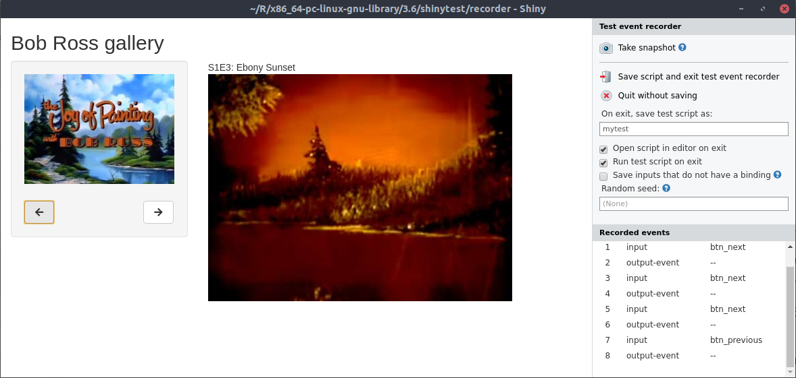
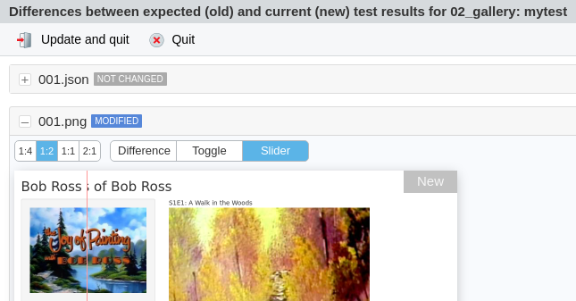

class: inverse
background-image: url("resources/title.jpg")
background-size: cover

```{r setup, include=FALSE}
options(htmltools.dir.version = FALSE, width = 120)

library(tidyverse)
library(shiny)
library(fontawesome)
library(countdown)

theme_set(
  theme_grey(base_size = 16) +
  theme(
    legend.position = "bottom",
    plot.background = element_rect(fill = "transparent"),
    legend.background = element_rect(fill = "transparent")
  )
)
```


```{css, echo=FALSE}
/* custom.css */
.left-code {
  color: #777;
  width: 40%;
  height: 92%;
  float: left;
}
.right-plot {
  width: 58%;
  float: right;
  padding-left: 1%;
}
```

<ul class="hextile clr">
	<li>
    <div>
      <h1>03</h1>
      <p style = "padding-top: 30%; font-size: 1.2em">Bug fixes & Testing</p>
    </div>
  </li>
  <li>
    
  </li>
  <li></li>
  </li>
  <li>
    <div>
      <p style = "padding-top: 15%; font-size: 1.33em">
      Mitchell O'Hara‑Wild<br>
      (Nectric)
      </p>
    </div>
  </li>
</ul>

.footnote[
Materials at [workshop.nectric.com.au/intermediate-shiny](https://workshop.nectric.com.au/intermediate-shiny)
]

---

# `r emo::ji("rainbow")` When Shiny works, it's wonderful!

<br><br>

--

# `r emo::ji("thunder")` When it doesn't, it can be frustrating!

```{r, echo = FALSE}
div(class = "error", 
"Error in .getReactiveEnvironment()$currentContext() : Operation not allowed without an active reactive context. (You tried to do something that can only be done from inside a reactive expression or observer.)")
```
```{r, echo = FALSE}
div(class = "error", 
"Error: object of type 'closure' is not subsettable")
```

---
class: topic-starter, center

# Troubleshooting Shiny

(many troubleshooting methods are also appropriate for any code)

---
class: iframe-page

<iframe src = "feud", style = "width:100%;height:100vh"></iframe>

---

# `r emo::ji("globe")` Searching for help online

It goes without saying that internet is useful!

--

For common bugs and error messages, it works great:

1. Copy the error
1. Paste into search bar
1. Add 'R' and 'shiny'
1. Find the answers (probably on StackOverflow!)

--

.sticker-float.img-spin[]

This also works for finding code you *need*!

> "r shiny add spinning image"

---

# `r emo::ji("cat2")` `cat()`/`print()` out app logs

Adding `print()` or `cat()` statements in your reactive code is an easy way to see what your app is doing.

```{r}
current_painting <- reactive({
  cat("Current painting is:", paintings$title[rv$painting])
  paintings[rv$painting,]
})
```

You could also add these logs to the browser's JavaScript console using `shinyjs::logjs()`.

---

.center.box-12.bg-blond[
# `r emo::ji("woman_technologist")` What is the Javascript console? `r emo::ji("man_technologist")`
]

Exactly like your R console, but for Javascript code.

For debugging, it is where JS errors/warnings/messages are found.
If you're writing JS, you can also run code here.

Press F12 in your web browser to open the console/inspector.

---

# `r emo::ji("red_circle")` Add breakpoints to your code

Breakpoints allow you to pause code right where you want.

They can be added by clicking left of the line number (`r emo::ji("red_circle")`), or adding the `browser()` function.

--

Using `browser()` is my preferred method. If is especially useful when used conditionally:

```{r, eval = FALSE}
if (input$value == something_bad){
  browser()
}
```
---

# `r emo::ji("red_circle")` Add breakpoints to your code

When browsing paused code, you can look and change any code you want.

Some commands are available when browsing code:

* `n`: **N**ext code statement
* `c`: **C**ontinue evaluation
* `f`: **F**inish the current code loop

---

# `r emo::ji("scroll")` Checking the reactive graph


Check materials for the ["reactivity session"](../reactive) if you missed it.

---
background-image: url("resources/showcase.png")
background-size: 40%
background-position: bottom

# `r emo::ji("framed_picture")` Showcase mode

Showcase mode displays the app alongside its code. Code will be highlighted as it runs on the server.

Enable showcase with `runApp(display.mode = "showcase")`.

--

https://shiny.rstudio.com/gallery/reactivity.html

---

# `r emo::ji("beetle")` Look for errors in the consoles

Errors in R code will appear in the R console.

--

Errors also previously appeared in the app, however in newer versions of Shiny they will not (for security reasons).

When debugging, you can disable error sanitisation with:

```{r, eval = FALSE}
options(shiny.sanitize.errors = FALSE)
```

---
class: feature

# `r emo::ji("shooting_star")` Your turn!

.box-12[
.float-right[
</img>
]

## Troubleshooting time! `r emo::ji("man_mechanic")` `r emo::ji("woman_mechanic")`

<br>

Open the `starwars` apps folder, and fix the bugs.

There are six broken apps, each with a different issue.

Each app has one type of error.

<br>

]

```{r, echo = FALSE}
countdown(minutes = 5L)
```


---
class: topic-starter, center

# Avoiding errors

(this also works for any code)

---

# `r emo::ji("dancer")` Code style

<br>

Writing good code won't eliminate errors...

--

.float-right[... but it will make them easier to fix.]

--

<br><br>

---

# `r emo::ji("+1")` Easy code improvements

## 1. Follow a style guide

Having a **consistent style** in your app makes errors stand out.

**Indentation** is especially important for readability of Shiny apps.

.box-12.bg-blond.center[
Code styles are so important that the tidyverse has a style guide book!
https://style.tidyverse.org/
]

The [`styler` package](https://styler.r-lib.org/) can help re-style old code automatically.

---

# `r emo::ji("+1")` Easy code improvements

## 2. Remove code duplication

Code repetition is problematic for many reasons:

* Requires repeated computation
* More places for bugs
* Updating code is a nightmare
* More complex to follow workflow

Replace duplicated code with **reactive expressions**.

---

# `r emo::ji("+1")` Easy code improvements

## 3. Split complex code into smaller steps

A chain of pipes 20 lines long may be impressive...

.float-right[... but it will be harder to debug.]

<br><hr><br>

Small code fragments are easier to verify their correctness.

Each code step should achieve one thing only - avoid side effects if possible.

---
class: iframe-page

<iframe width="100%" height="680px" src="https://www.youtube.com/embed/7oyiPBjLAWY" frameborder="0" allow="accelerometer; autoplay; encrypted-media; gyroscope; picture-in-picture" allowfullscreen></iframe>

---
class: feature

# `r emo::ji("shooting_star")` Your turn!

.box-12[

## Improve the code style! `r emo::ji("dancer")`

<br>

Open the `01_sw_style` app and improve the code's style.

There's also a style related error introduced into the UI - oops!

<br>

]

```{r, echo = FALSE}
countdown(minutes = 3L)
```


---
class: bg-yellow feature

# `r emo::ji("target")` Today's goals

<br>

.box-12.larger[
1. Learn how to add **automatic tests** to shiny apps
1. **More reactive code** with dynamic user interfaces
1. Customise the **look and feel** of apps
1. Use **extension packages** to add functionality
1. **Apply** the workshop content to your own apps
]

---

.pull-left[
Workshop day 1

| Time          | Activity                                                      |
|:--------------|:--------------------------------------------------------------|
| 09:00 - 09:30 | Arrive and get set up `r emo::ji("computer")`                              |
| 09:30 - 10:45 | Session 1 `r emo::ji("sparkles")` <br> *Introduction to Shiny (part 1)*             |
| 10:45 - 11:00 | *Morning tea* `r emo::ji("tea")`                                    |
| 11:00 - 12:30 | Session 1 `r emo::ji("sparkles")` <br> *Introduction to Shiny (part 2)*                |
| 12:30 - 13:15 | *Lunch* `r emo::ji("fork_and_knife")`                                      |
| 13:15 - 14:45 | Session 2 `r emo::ji("boom")` <br> *Reactive programming I*         |
| 14:45 - 15:00 | *Q&A break* `r emo::ji("question")`                                        |
| 15:00 - 16:30 | Session 3 `r emo::ji("trophy")` <br> *Troubleshooting and testing*               |

]

.pull-right[
Workshop day 2

| Time          | Activity                                                      |
|:--------------|:--------------------------------------------------------------|
| 09:00 - 09:30 | Arrive and get set up `r emo::ji("computer")`                          |
| 09:30 - 10:45 | Session 1 `r emo::ji("boom")` <br> *Reactive programming II*   |
| 10:45 - 11:00 | *Morning tea* `r emo::ji("tea")`                                           |
| 11:00 - 12:30 | Session 2 `r emo::ji("link")` <br> *Doing more with extension packages*    |
| 12:30 - 13:15 | *Lunch* `r emo::ji("fork_and_knife")`                                      |
| 13:15 - 15:00 | Session 3 `r emo::ji("tada")` <br> *Work on your own Shiny app*            |
]


---
class: topic-starter, center

# Testing for errors

---

.box-12.center.bg-blond[
# `r emo::ji("question")` Why write tests `r emo::ji("question")`
]

> Even if you don’t, someone will test your software
>
> [Dave Cheney](https://dave.cheney.net/2019/05/14/why-bother-writing-tests-at-all)

--

1. Tests indicate failure points of your app.
1. They prevent future changes unknowingly breaking old code.
1. Bugs should only exist once, don't resurrect them.
1. A vote of confidence that your app works as expected.
1. Tests may fail even when your code doesn't - R/packages update, servers change, etc.

---

# `r emo::ji("white_heavy_check_mark")` Testing Shiny apps with shinytest

Creating and running tests for an app takes just three steps:

### 1. Launch the app with test recording

```{r, eval = FALSE}
library(shinytest)

# Launch the target app (replace with the correct path)
recordTest("path/to/app")
```

--

### 2. Use the app and take snapshots

App usage is tracked on the right, and snapshots store a set of values for comparison.

--

### 3. Check the recorded tests against the app

```{r, eval = FALSE}
testApp("path/to/app")
```

---

# Creating tests for the Bob Ross gallery

```{r, eval = FALSE}
library(shinytest)
recordTest("../../apps/day_1/gallery/02_gallery/")
```



---

# `r emo::ji("pray")` Checking that the tests pass

<br><br>

```{r, echo = FALSE}
library(shinytest)
```

```{r}
testApp("../../apps/day_1/gallery/02_gallery/")
```

---
class: feature

# `r emo::ji("shooting_star")` Your turn!

.box-12[

## Modify the gallery `r emo::ji("wrench")`

What happens when tests fail?

1. Open the 02_gallery app
1. Change the ui in any way (perhaps change the title)
1. Re-run the tests

<br>

]

```{r, echo = FALSE}
countdown(minutes = 1L, seconds = 30L)
```

---

# `r emo::ji("slider")` The shinytest diff tool

Neat tool for visualising changes made to the app.

Are they the changes you want?



---

# `r emo::ji("bee")` Testing in a dynamic environment

## Controlling randomness

If your app is random, output will always differ.
For consistent test environments, set the random seed via the recorder UI.


---

# `r emo::ji("bee")` Testing in a dynamic environment

## Other dynamic app behaviour

When testing, `getOption("shiny.testmode")` will be `TRUE`.

You can use this to load static variables or data sources.

```{r, eval = FALSE}
if (isTRUE(getOption("shiny.testmode"))) {
  # Load static/dummy data here
} else {
  # Load normal dynamic data here
}
```

---

# `r emo::ji("bee")` Testing in a dynamic environment

## Non-app dynamic environments 

--

1. Web browsers (Chrome/Firefox/Safari/Edge/Other?)
1. Operating systems (Windows/Mac/Other?)
1. Devices (Desktop/Mobile?)
1. Country of origin

<br>

### These 'environment variables' are much harder to test.

---
class: feature

# `r emo::ji("checkered_flag")` Extra time?

.box-12[
## Tests your shiny app

1. Try to break your app. Use the most obscure input values.
1. Add automatic tests to your app with `shinytest`.
]

---
class: feature

# `r emo::ji("clock230")` Q&A break!

<br><br><br>

.box-12[
## Next topic: More reactivity `r emo::ji("boom")`
]

```{r, echo = FALSE}
countdown(minutes = 15L)
```
